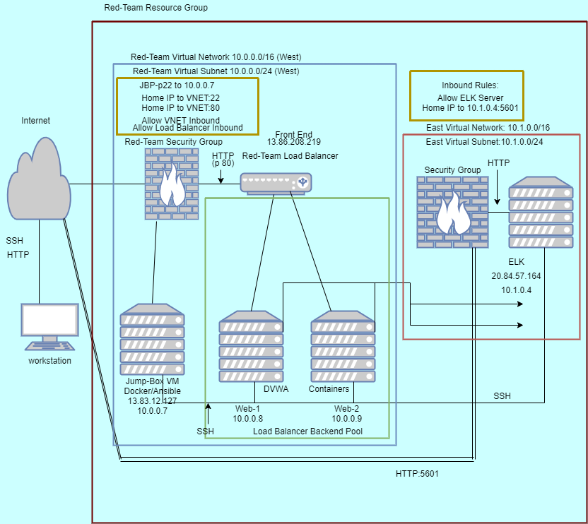
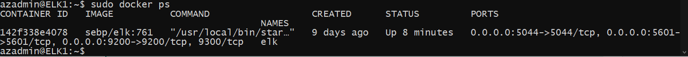
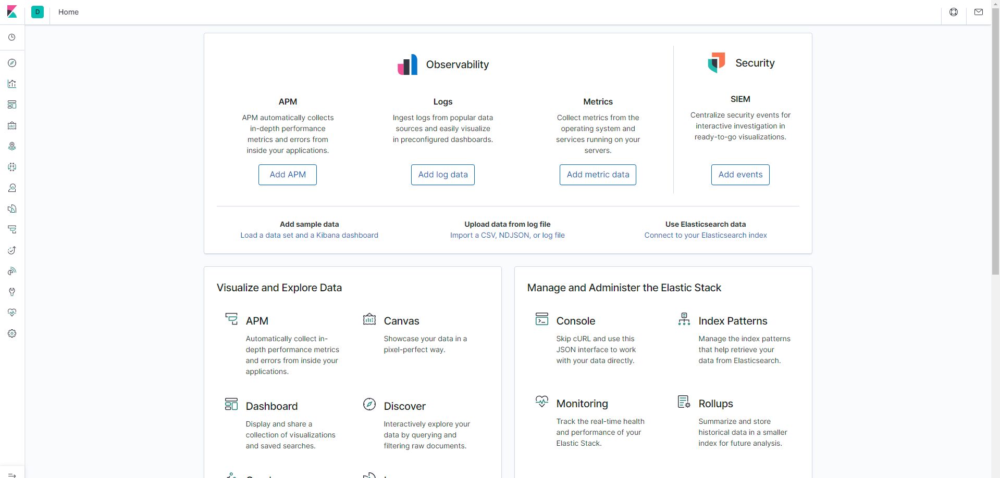
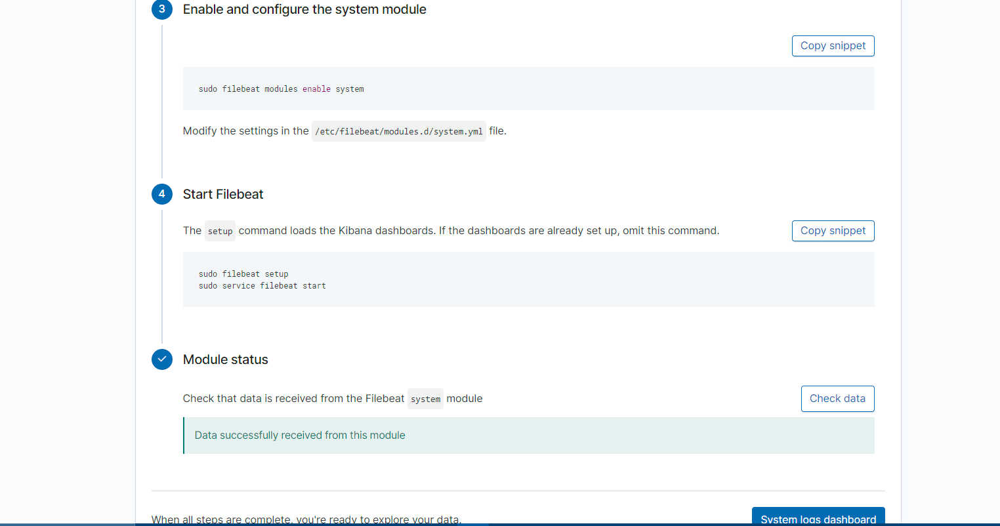
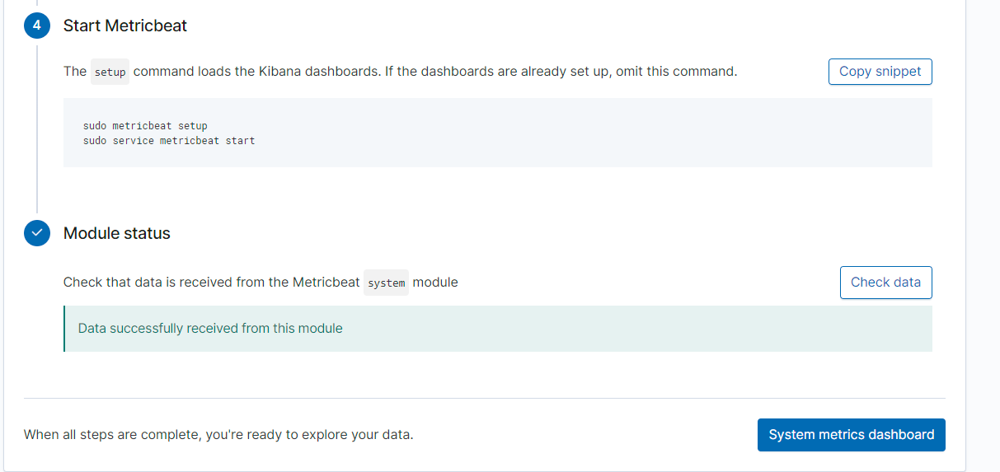
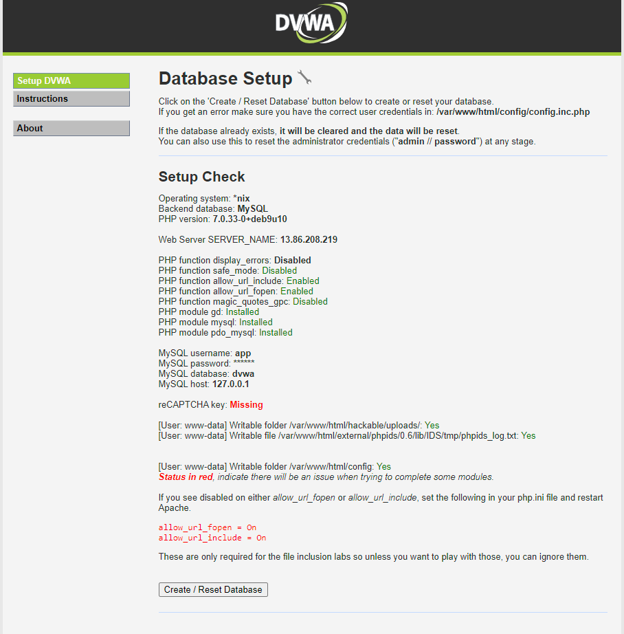

# Vanderbilt-Cybersecurity-Project-One
ELK stack project
## Automated ELK Stack Deployment

The files in this repository were used to configure the network depicted below.

_(Images/diagram_filename.png)_

These files have been tested and used to generate a live ELK deployment on Azure. They can be used to either recreate the entire deployment pictured above. Alternatively, select portions of the **Ansible**file may be used to install only certain pieces of it, such as Filebeat.

  - [ansible.cfg](Ansible/ansible.cfg)
  - [hosts](Ansible/hosts)
  - [Configuring.yml](Ansible/Configuring.yml)
  - [install-elk.yml](Ansible/install-elk.yml)
  - [filebeat-config.yml](Ansible/filebeat-config.yml)
  - [filebeat-playbook.yml](Ansible/filebeat-playbook.yml)
  - [metricbeat-config.yml](Ansible/metricbeat-config.yml)
  - [metricbeat-playbook.yml](Ansible/metricbeat-playbook.yml)

This document contains the following details:
- Description of the Topologu
- Access Policies
- ELK Configuration
  - Beats in Use
  - Machines Being Monitored
- How to Use the Ansible Build

### Description of the Topology

The main purpose of this network is to expose a load-balanced and monitored instance of DVWA, the D*mn Vulnerable Web Application.

Load balancing ensures that the application will be highly available, in addition to restricting access to the network.
- Load balancers protect the **availability** of a system. Network traffic is balanced thus protecting against the system being overloaded. Load balancers can protect against **DDoS attacks** and can **authenticate** user access. **Web Application Firewalls** in the load balancer protects your website from hackers and includes daily rule updates just like a virus scanner. There are many more advantages to using load balancers.

- An advantage of using jump box is how it will segment your system. You remotely access your jump box with an SSH key. Then, you need another ssh key to access your web servers. Your system is not prone to brute force attacks as there are no passwords being used. Access is only made with a **public** and **private** key pair. 

Integrating an ELK server allows users to easily monitor the vulnerable VMs for changes to the logs and system metrics.
- Filebeat monitors the log files or locations that you specify, collects log events, and forwards them either to Elasticsearch or Logstash for indexing.
- Metricbeat helps you monitor your servers by collecting metrics from the system and services running on the server.

The configuration details of each machine may be found below.
_Note: Use the [Markdown Table Generator](http://www.tablesgenerator.com/markdown_tables) to add/remove values from the table_.

|   Name   | Function       | IP Address        | Operating System   |
|----------|----------------|-------------------|--------------------|
| -------- | -------------- | ----------------- | ------------------ |
| Jump Box | Provisioner    | 10.0.0.7          | Linux Ubuntu 18_04 |
| Web-1    | Web Server     | 10.0.0.8          | Linux Ubuntu 18_04 |
| Web-2    | Web Server     | 10.0.0.9          | Linux Ubuntu 18_04 |
| ELK      | Log Monitoring | 10.1.0.4          | Linux Ubuntu 18_04 |

### Access Policies

The machines on the internal network are not exposed to the public Internet. 

Only the Jump-Box Provisioner machine can accept connections from the Internet. Access to this machine is only allowed from the following IP addresses:
- 13.83.12.127

Machines within the network can only be accessed by an Ansible Docker Container.
- The ELK VM is only made accesible through the Jump-Box Provisioner using SSH. It is accessed at the 10.1.0.4 address.

A summary of the access policies in place can be found in the table below.

|       Name       | Port   | Source        | Protocol  | Destination | Security Group |
|------------------|--------|---------------|-----------|-------------|----------------|
| -----------------| ------ | ------------- | --------- | ----------- | -------------- |
| ssh              | 22     | Home-IP       | TCP       | 10.0.07     | Red-team       |
| red-team-VN      | 80     | Home-IP       | TCP       | VNET        | Red-team       |
| ssh-from-jumpbox | 22     | 10.0.0.7      | TCP       | VNET        | Red-team       |
| 5601             | 5601   | Home-IP       | TCP       | 10.1.0.4    | ELK1           |
### Elk Configuration

Ansible was used to automate configuration of the ELK machine. No configuration was performed manually, which is advantageous because...
- You can configure multiple machines all at once saving valuable time.
- Potential errors in configurations are greatly reduced.
- Potential savings in overhead as implementation can be accomplished by a much smaller workforce.

The playbook implements the following tasks:
- **Install** Docker.io
- **Install** Python3-pip
- **Install** pip docker module
- Runs command to increase the virtual memory to **262144** in current status and at restart
- Download and launch docker elk container **sebp/elk:761** and **enable** on boot

The following screenshot displays the result of running `docker ps` after successfully configuring the ELK instance.

_[TODO: Update the path with the name of your screenshot of docker ps output](Images/docker_ps_output.png)_

### Target Machines & Beats
This ELK server is configured to monitor the following machines:
- 10.0.0.8-Web-1 DVWA
- 10.0.0.9-Web-2 DVWA

We have installed the following Beats on these machines:
- Filebeat
- Metricbeat

These Beats allow us to collect the following information from each machine:
- Filebeat collects system log data from the web servers. Geo location, ssh logins, and time stamps are all collected and presented. There are many types of information that can be collected in addition to these.
-Metricbeats collects information from the system and services running on the server. Network traffic and CPU usage are monitored. Apache, MySQL, and Nginx can all be monitored using metricbeats. There are many types of information that can be gathered using metricbeats in addition to the above. 

### Using the Playbook
In order to use the playbook, you will need to have an Ansible control node already configured. Assuming you have such a control node provisioned: 

SSH into the control node and follow the steps below:
- Copy the filebeat-config.yml and metricbeat-config.yml files to /etc/ansible/files.
- Update the configuration files to include the private IP of the ELK server to the Kibana and ElasticSearch sections.
- Run the playbook, and navigate to http://(local-IP):5601/app/Kibana to check that the installation worked as expected.
# This site should load

_TODO: Answer the following questions to fill in the blanks:_
- **install-elk.yml** is the playbook used to install the ELK server. It is in **/etc/ansible/roles**
- You must update the hosts file in /etc/ansible. The IP addresses of your webservers must be updated. an ELK group must also be added with its IP address. **cd /etc/ansible**, then **nano hosts**

- 
- To check to see if your server is running and gathering information: **http://(local-IP)(ELK):5601/app/kibana**
- These are only two of the logs generated

# Basic Commands needed#
- ssh -i ~/.ssh/id_rsa <username>@IP
- **sudo docker container list -a** will list your Docker container
- **sudo docker start silly_name** to start the container
- **sudo docker attach silly_name** to connect you as the root of the container
- **cd /etc/ansible** holds the directory of ansible
- **http://(Web-Server-IP)/setup.php** will take you to the DVWA site

# Playbooks are always run with the command **ansible-playbook** <filename>.yml
  - **ansible-playbook install-elk.yml**
  - **ansible-playbook filebeat-playbook.yml**
  - **ansible-playbook metricbeat-playbook.yml**

_As a **Bonus**, provide the specific commands the user will need to run to download the playbook, update the files, etc._

References: https://www.elastic.co/guide/en/beats/metricbeat/current/metricbeat-overview.html, https://www.elastic.co/guide/en/beats/filebeat/current/filebeat-overview.html, https://lumecloud.com/what-does-a-load-balancer-do/
